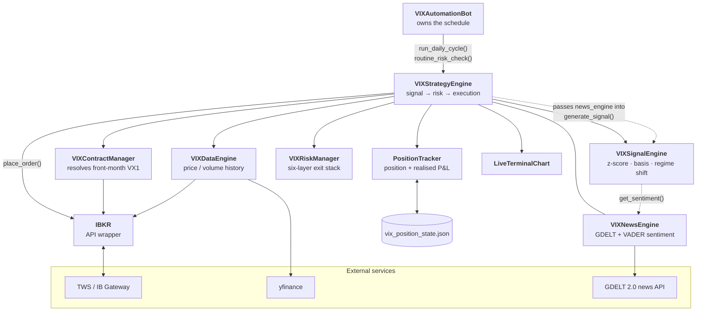
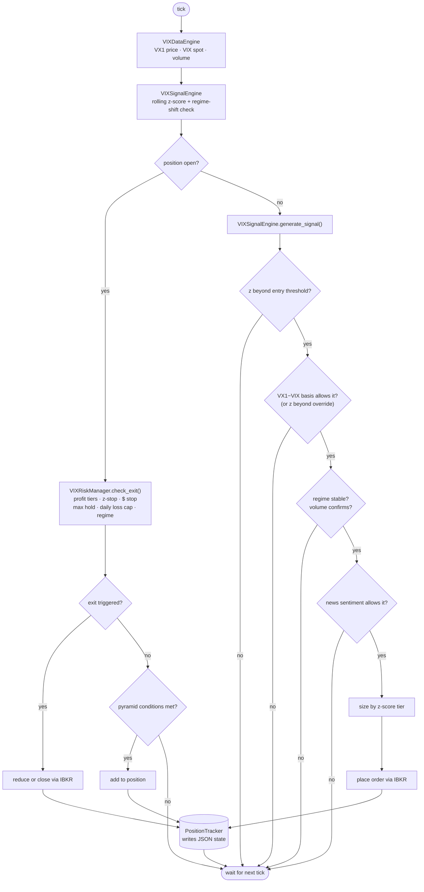
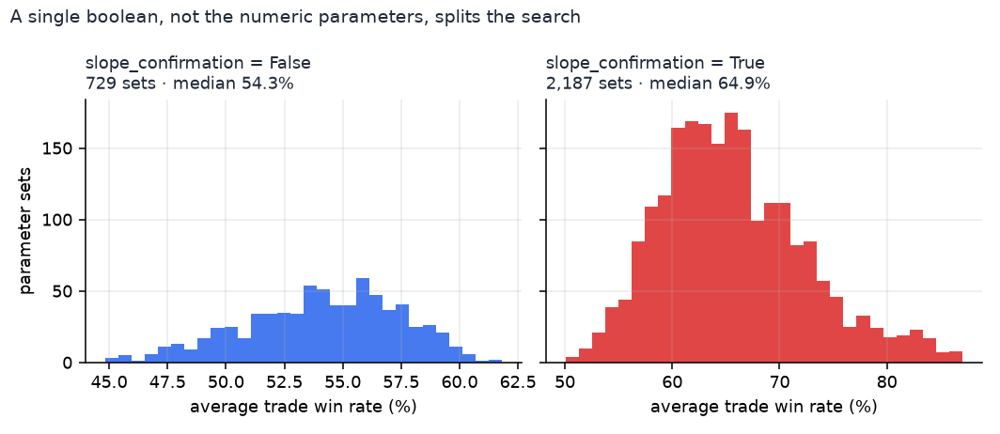
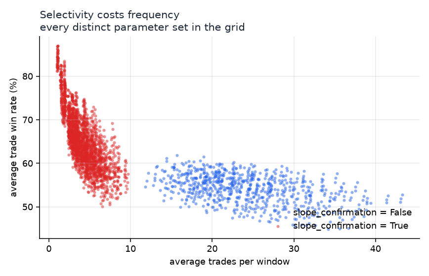
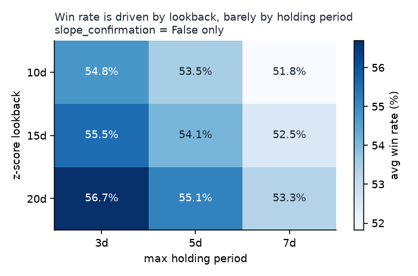

# VIX Mean Reversion — Strategy and Automated IBKR Execution

A VIX futures mean-reversion strategy, from signal research through to an automated
execution system on the Interactive Brokers API.

The strategy trades front-month VIX futures around a rolling z-score of VIX spot,
with three gating filters — term structure, regime shift, and geopolitical news
sentiment — and a six-layer exit stack. Signal parameters were chosen with a
rolling-window grid search over **2,916 distinct parameter sets** of VIX history.
The live system runs unattended: it resolves the front-month contract, evaluates a
signal on a daily schedule, re-checks risk and entry conditions every minute, and
survives a restart without losing its position state.

> **Scope.** Research and paper-trading infrastructure, not investment advice.
> Defaults point at an IBKR **paper** account.

---

## Contents

[Performance](#performance) · [Strategy](#strategy) · [Architecture](#architecture) · [Live system](#live-system) ·
[Parameter selection](#parameter-selection) · [Deployment](#deployment) · [Configuration](#configuration) ·
[Layout](#layout) · [Limitations](#limitations)

---

## Performance

Evaluated over **217 rolling 2-month windows spanning 1990–2026**, net of IBKR
commissions and per-leg slippage, benchmarked against SPY:

| Metric | Value |
|---|---|
| Sharpe ratio (annualised) | **1.64** |
| Average 2-month return | **+4.07%** (median +3.42%) |
| Windows profitable | **84%** |
| Trade win rate | 56.2% |
| Average max drawdown per window | −5.60% |
| Worst window | −22.7% (Feb 2020) |
| Correlation to SPY | −0.15 |

The strategy is a diversifier rather than a return-maximiser: negative beta to
equities, ~15% annualised volatility, and a return stream that is structurally
decorrelated from the S&P. The worst window is the February 2020 volatility spike —
the known tail of any short-volatility strategy, and the reason the news-sentiment
filter exists.

**Provenance.** These figures come from a separate performance study that modelled
transaction costs and SPY-relative statistics. That analysis is not part of this
repository — `vix_backtest.py` here is a parameter-search engine with a different
and narrower purpose, so running it will not reproduce the table above. See
[Parameter selection](#parameter-selection) and [Limitations](#limitations).

---

## Strategy

**Base signal — z-score mean reversion.** Compute `z = (VIX − μ) / σ` over a
20-day rolling window of VIX spot.

- **Short VX1** when `z ≥ 0.75` — VIX is unusually high and tends to fall back.
- **Long VX1** when `z ≤ −1.0` — VIX is unusually low.

The thresholds are **asymmetric**, and deliberately so. VIX is right-skewed: it
spikes upward and drifts downward, so upside dislocations revert more reliably than
downside ones and earn a slightly lower bar. 0.75 is also the most conservative
short threshold the grid search covered — short volatility collects small premiums
and loses in large jumps, so a marginal short entry carries more tail risk than an
averaged score reflects.

**Filter A — term structure (VX1 − VIX basis).**
Deep contango favours short-VIX (roll yield is a tailwind); backwardation
suppresses short-VIX and permits long-VIX. Two overrides let an extreme z-score
outrank the term structure: `Z_BASIS_OVERRIDE` (short into backwardation) and
`Z_CONTANGO_OVERRIDE` (long into contango). Live only — the backtest has no VX1
series, so this filter is untested.

**Filter B — regime shift (dual lookback).**
Compare a fast z-score against a slow 30-day one. A large divergence means the
distribution itself is moving, so reverting toward a stale mean is the wrong
trade — new entries and pyramid adds are blocked while the flag is up. Live only.

**Filter C — news sentiment (GDELT + VADER).**
`vix_news.py` polls the GDELT 2.0 document API for a configurable geopolitical
keyword set, scores each article with VADER, and blocks mean-reversion entries when
aggregate sentiment crosses a threshold. Thresholds are asymmetric — fear gates a
short faster than relief gates a long. The point is to avoid the classic short-vol
failure: selling volatility into a genuine regime change rather than into noise.
Live only; GDELT 2.0 begins in 2015 and cannot be evaluated over the backtest window.

**Exits — six layers.** Graduated profit-taking as the z-score decays, a z-score
stop, an absolute dollar stop, a maximum holding period, a daily loss cap, and a
regime-triggered forced exit.

**Sizing.** Z-score tiered — a larger dislocation gets a larger clip, up to
`MAX_CONTRACTS` — with optional pyramiding as a position extends further.

---

## Architecture

`vix_main.py` builds one `IBKR` connection, hands it to a `VIXStrategyEngine`, and
wraps that in a `VIXAutomationBot` that owns the schedule. The engine composes every
other component and is the only place trading decisions are made.



The engine holds `news_engine` and passes it into `generate_signal()`, so the signal
layer stays usable without a news feed — set `NEWS_SENTIMENT_ENABLED = False` and
nothing else changes.

### One cycle

Both the daily job and the minute-level job run the same shape: refresh data,
recompute the z-score, manage an open position first, and only then consider a new
entry.



---

## Live system

`vix_strategy.py` is built from seven components plus a terminal chart, each with
one job:

| Component | Responsibility |
|---|---|
| `VIXContractManager` | Resolves the VIX futures contract, auto-selecting the front month |
| `VIXDataEngine` | Dual market-data sources (yfinance + IBKR) with local persistence |
| `VIXSignalEngine` | Rolling z-score, asymmetric long/short thresholds, regime-shift detection |
| `VIXRiskManager` | The six-layer exit stack |
| `PositionTracker` | Position state persistence and pyramid bookkeeping |
| `VIXStrategyEngine` | Orchestrates the signal → risk → execution workflow |
| `VIXAutomationBot` | Scheduled signal checks plus minute-level risk monitoring |
| `LiveTerminalChart` | Draws the running z-score and position in the terminal (`plotext`) |

Two design choices worth calling out:

- **Dual data sources.** yfinance and IBKR are both polled, so a single feed
  hiccup does not silently freeze the signal.
- **State on disk.** Position state is written to JSON after every change, so a
  crash or restart resumes with the correct position rather than a blank slate.

**Timing.** `DAILY_SIGNAL_TIME` schedules the main daily evaluation, but the
minute-level risk loop also opens new positions when the book is flat and the
session is open — so entries are not confined to the afternoon check.

---

## Parameter selection

`vix_backtest.py` is a **parameter-search engine**, separate from the performance
study above. Its job is to rank signal parameters against one another, not to
simulate P&L: it has no transaction-cost model and no equity floor, so its ratio
metrics are not comparable to the Performance table. The statistics reported in
this section are therefore limited to **trade win rate** and **trades per window** —
both computed from realised trade P&L signs and counts, so neither depends on the
account equity path.

The grid is `3 × 3 × 3 × 3 × 3 × 3 × 3 × 2 = 4,374` rows, but `slope_lookback` is
unreachable when `slope_confirmation` is `False`, so those rows are exact
triplicates: **2,916 distinct parameter sets**. Each was scored across **216
overlapping 102-day windows** — a 42-day step with a 60-day lead-in — spanning
CBOE VIX spot from 1990-01-02 to 2026-03-20.

### One boolean splits the entire search



`slope_confirmation` dominates every numeric parameter combined. Requiring the
short-horizon VIX slope to agree with the reversion direction raises selectivity
sharply but suppresses most entries; the shipped configuration leaves it off.

### Selectivity costs frequency



The two clusters are the same trade-off seen from the other side: filters that lift
win rate do so by refusing trades. There is no corner of this grid that gets both.

### Sensitivity to the two structural parameters



Within the shipped regime, win rate rises with the z-score lookback and falls
slightly as the holding period lengthens. The best cell — a 20-day lookback with a
3-day maximum hold, at 56.7% — is the shipped configuration.

Regenerate all three with `python make_figures.py grid_results.csv`.

### Selected parameters

| Parameter | Value | Why |
|---|---|---|
| `Z_LOOKBACK` | 20 | Highest win rate of the three lookbacks tested, at every holding period |
| `Z_ENTRY_SHORT` | 0.75 | Most conservative short threshold in the grid; short-vol tail risk is one-sided |
| `Z_ENTRY_LONG` | 1.0 | Higher bar for longs; VIX's right skew makes downside dislocations less reliable |
| `Z_EXIT` | 0.3 | **Backtest only** — the live system exits through `PROFIT_TAKE_TIERS` and never reads this |
| `Z_STOP` | 2.5 | The widest stop tested. A mean-reversion entry is already against the recent move, so a tight stop mostly harvests noise before the reversion arrives |
| `MAX_HOLD_DAYS` | 3 | Best win rate at a 20-day lookback, and the fastest turnover of the three |
| `SLOPE_CONFIRMATION` | False | On, it suppresses most entries — see the first figure |

⚠️ **Re-running `python vix_backtest.py` will not reproduce the grid above.** The
committed `main()` slices the data to `2020-01-01` onward and uses a 21-day window,
producing 72 windows rather than 216, and ranks by average return rather than by
any risk-adjusted measure ("Competition Mode"). The 216-window configuration used
for `grid_results.csv` was a one-off edit that is not in this repository.

---

## Deployment

**1. Install.**

```bash
python -m venv .venv && source .venv/bin/activate   # Windows: .venv\Scripts\activate
pip install -r requirements.txt
python -c "import nltk; nltk.download('vader_lexicon')"
```

**2. Start IBKR.** Launch TWS or IB Gateway, log into a **paper** account, and
enable the API (TWS → Settings → API → *Enable ActiveX and Socket Clients*).
Paper ports are `7497` for TWS and `4002` for Gateway.

**3. Set your account.** Put your own paper account id in `IB_ACCOUNT`
(`vix_config.py`). The bot refuses to start if that account is not among the ones
your TWS session manages — a guard against connecting to a session that also holds
a live account.

**4. Run.**

```bash
python vix_main.py                        # live loop: daily signal + minute risk checks
python vix_backtest.py                    # parameter grid search (see the warning above)
python make_figures.py grid_results.csv   # regenerate docs/img from a results CSV
python vix_fetch_history.py               # refresh the stitched VIX futures history
```

`REQUIRE_APPROVAL = True` ships as the default: every order is printed and waits
for a `y/n` at the console. Set it to `False` for unattended execution once you
trust the configuration.

---

## Configuration

Live tunables live in `vix_config.py`, grouped and annotated by origin — every block
states whether its values were grid-selected, are live-only controls, or are read by
the backtest alone. **`vix_backtest.py` does not import this file**: its grid and
defaults are hardcoded, so editing `vix_config.py` has no effect on a grid search.

| Block | Keys |
|---|---|
| Signal | `Z_LOOKBACK`, `Z_ENTRY_SHORT`, `Z_ENTRY_LONG`, `Z_STOP`, `MAX_HOLD_DAYS` |
| Risk | `MAX_LOSS_PCT`, `DAILY_MAX_LOSS_PCT`, `PROFIT_TAKE_TIERS` |
| Sizing | `MAX_CONTRACTS`, `POSITION_SIZE_TIERS`, `PYRAMID_ENABLED` |
| News | `NEWS_SENTIMENT_ENABLED`, `NEWS_KEYWORDS`, `NEWS_*_THRESHOLD_*` |
| IBKR | `IB_ACCOUNT`, `IB_PORT` |
| Schedule | `DAILY_SIGNAL_TIME`, `RISK_INTERVAL_MINUTES` |

`NEWS_KEYWORDS` ships with an example set from the period this was run. The filter
is only as good as its query — replace them with whatever macro theme is actually
driving volatility.

---

## Layout

```
vix_main.py             entry point: IBKR connection + strategy engine + automation bot
vix_strategy.py         core engine (the components above)
vix_ibkr.py             IBKR API wrapper: connection, market data, orders, P&L
vix_news.py             GDELT 2.0 fetch + VADER sentiment scoring
vix_backtest.py         parameter grid search (self-contained; ignores vix_config.py)
make_figures.py         regenerates docs/img from a grid-search results CSV
vix_fetch_history.py    downloads and stitches front-month VIX futures history
vix_config.py           live tunables, annotated by origin
VIX_History.csv         CBOE VIX spot, 1990-2026 — the grid-search input
grid_results.csv        grid-search output behind the figures above
vix_futures_history.csv stitched VX1/VX2 history produced by vix_fetch_history.py
                        (reference data — no runtime code reads it)
vix_spot_history.csv    VIX spot cache written by the live data engine
docs/img/               figures used in this README
archive/                earlier research notebooks (vix_v0, vix_v1)
```

---

## Limitations

Stated plainly and at length, because they bound what this code can and cannot show.

1. **`vix_backtest.py` has no equity floor.** `_compute_metrics` runs
   `pct_change()` and peak-relative drawdown over an equity series that is allowed
   to go below zero, and roughly half the grid does exactly that. Once equity
   crosses zero the sign of a return flips, so Sharpe, Calmar and drawdown computed
   *by this engine* stop meaning anything — which is why the parameter-selection
   section reports only win rate and trade counts. It does not affect the
   Performance table, which comes from a different analysis. Fixing it needs a hard
   stop at zero equity and a re-run.

2. **The backtest trades VIX spot as a proxy for the front-month future.** A long
   VX1 price history is not freely available; `VIX_History.csv` is CBOE spot. Spot
   and VX1 are highly correlated, but the proxy cannot capture roll yield or the
   basis — precisely where a short-vol strategy earns much of its return.

3. **Windows overlap and the lead-in is traded.** Each window spans 102 trading
   days and steps forward 42, so consecutive windows share 60 days, and `run()`
   begins trading from day `z_lookback` rather than at the end of the lead-in.
   Every trade is therefore counted in roughly three windows. Any per-window
   statistic describes about five months of trading, not two.

4. **Selection is in-sample.** `rolling_optimize` scores each combination on all
   216 windows and the winner is chosen on that same average. There is no
   out-of-sample holdout and no walk-forward step, so the selected parameters carry
   an unmeasured amount of selection bias.

5. **No transaction costs in the search engine.** Commissions and slippage are not
   modelled anywhere in `vix_backtest.py`. The Performance table at the top does
   include them, because it comes from the separate study — but that study's code
   is not in this repository, so those numbers cannot be regenerated from here.

6. **The backtest is a different strategy from the live system.** What the grid
   actually tests is the z-score entry, a single `Z_EXIT` threshold, the absolute
   and daily loss stops, the max-hold cap and the VIX-level regime filter. Absent
   from it: the VX1−VIX basis filter and both of its overrides, the dual-lookback
   regime-shift detector, the graduated `PROFIT_TAKE_TIERS` ladder, volume
   confirmation, news sentiment, and pyramiding. The live risk caps are also
   tighter than the backtest's (4% / 5% per trade and per day, against 3% / 8%).

7. **Paper account.** Everything shipped points at IBKR paper. The system has not
   been run against real money.

---

## License

MIT
