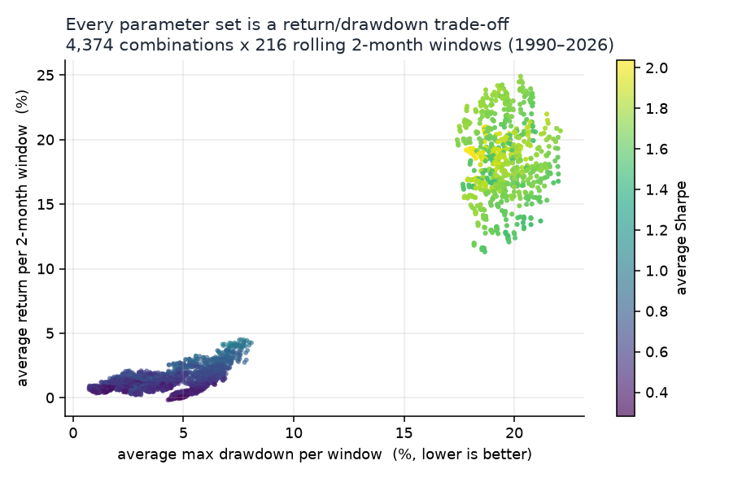
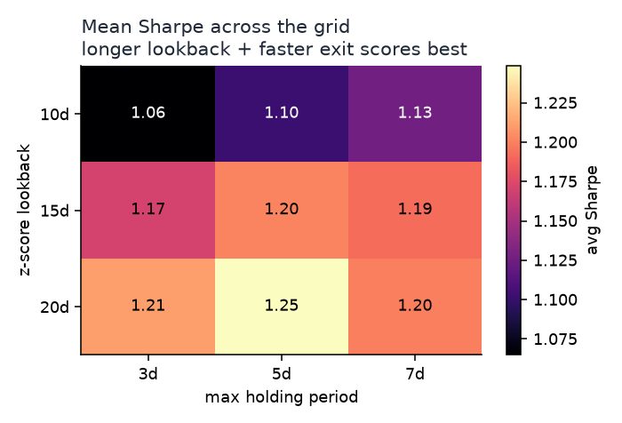
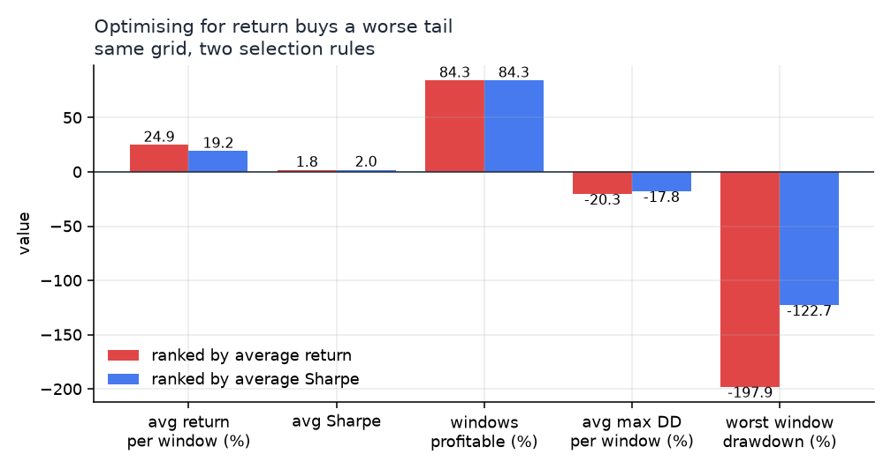
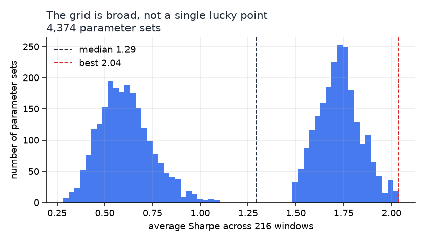

# VIX Mean Reversion — Strategy and Automated IBKR Execution

A VIX futures mean-reversion strategy, from signal research through to an automated
execution system on the Interactive Brokers API.

The strategy trades front-month VIX futures around a rolling z-score of VIX spot,
with three gating filters — term structure, regime shift, and geopolitical news
sentiment — and a six-layer exit stack. Parameters are chosen by a walk-forward
grid search over **4,374 parameter sets × 216 rolling 2-month windows** of VIX
history (1990–2026). The live system runs unattended: it resolves the front-month
contract, evaluates a signal each afternoon, monitors risk every minute, and
survives a restart without losing its position state.

> **Scope.** This is research and paper-trading infrastructure, not investment
> advice and not a live money-management system. Defaults point at an IBKR **paper**
> account. Read [Limitations](#limitations) before doing anything else with it.

---

## Contents

[Strategy](#strategy) · [Parameter selection](#parameter-selection) ·
[Limitations](#limitations) · [Live system](#live-system) ·
[Deployment](#deployment) · [Configuration](#configuration) · [Layout](#layout)

---

## Strategy

**Base signal — z-score mean reversion.** Compute `z = (VIX − μ) / σ` over a
20-day rolling window of VIX spot.

- **Short VX1** when `z ≥ 0.3` — VIX is unusually high and tends to fall back.
- **Long VX1** when `z ≤ −1.0` — VIX is unusually low.

The thresholds are deliberately **asymmetric**. VIX is right-skewed: it spikes
upward and drifts downward, so upside dislocations revert more reliably than
downside ones and deserve a lower bar.

**Filter A — term structure (VX1 − VIX basis).**
Deep contango favours short-VIX (roll yield is a tailwind); backwardation
suppresses short-VIX and permits long-VIX. Two overrides let an extreme z-score
outrank the term structure: `Z_BASIS_OVERRIDE` (short into backwardation) and
`Z_CONTANGO_OVERRIDE` (long into contango).

**Filter B — regime shift (dual lookback).**
Compare a fast z-score against a slow 30-day one. A large divergence means the
distribution itself is moving, so reverting toward a stale mean is the wrong
trade — new entries and pyramid adds are blocked while the flag is up.

**Filter C — news sentiment (GDELT + VADER).**
`vix_news.py` polls GDELT 2.0 for a configurable geopolitical keyword set, scores
each item with VADER, and blocks mean-reversion entries when aggregate sentiment
crosses a threshold. Thresholds are asymmetric — fear gates a short faster than
relief gates a long. The point is to avoid the classic short-vol failure: selling
volatility into a genuine regime change rather than into noise.

**Exits — six layers.** Graduated profit-taking as the z-score decays, a z-score
stop, an absolute dollar stop, a maximum holding period, a daily loss cap, and a
regime-triggered forced exit.

**Sizing.** Z-score tiered — a larger dislocation gets a larger clip, up to
`MAX_CONTRACTS` — with optional pyramiding as a position extends further.

---

## Parameter selection

`vix_backtest.py` is a **parameter-search engine**: it scores a grid of signal
parameters across rolling windows and reports which settings hold up over time.
It is not a full performance-attribution backtest — see [Limitations](#limitations).

The search covers `3 × 3 × 3 × 3 × 3 × 3 × 3 × 2 = 4,374` parameter sets, each run
across **216 rolling 2-month windows** spanning January 1990 to March 2026 —
about 945,000 individual window backtests.

### Every parameter set is a return/drawdown trade-off



### Parameter sensitivity

A longer z-score lookback with a faster exit scores best on Sharpe. The edge is a
quick reversion; holding longer mostly adds variance.



### The objective function matters more than the winner

Ranking the same grid by average return instead of by Sharpe picks a set that earns
roughly 30% more per window — and roughly doubles the worst-window drawdown. The
shipped configuration is the **Sharpe-ranked** winner for that reason.



### The result is a broad plateau, not a lucky point



Most of the grid clusters in a similar band, which is the reassuring outcome: the
selected parameters sit on a plateau rather than a spike, so performance is not an
artefact of one fragile combination.

### Selected parameters

| Parameter | Value | Why |
|---|---|---|
| `Z_LOOKBACK` | 20 | Beat 10d/15d on Sharpe — a slower baseline treats a spike as an outlier instead of re-centring on it |
| `Z_ENTRY_SHORT` | 0.3 | Lower bar for shorts; VIX's right skew makes upside dislocations more reliable |
| `Z_ENTRY_LONG` | 1.0 | Higher bar for longs |
| `Z_EXIT` | 0.3 | Exiting just before the mean beat exiting at it — the last leg of a reversion is the slowest |
| `Z_STOP` | 2.0 | Stop offset in sigma from entry |
| `MAX_HOLD_DAYS` | 3 | Short holds dominated the grid |
| `SLOPE_CONFIRMATION` | False | Requiring slope agreement suppressed too many entries |

Re-run the search yourself with `python vix_backtest.py`.

---

## Limitations

Stated plainly, because they bound what the numbers above mean.

1. **The backtest trades VIX spot as a proxy for the front-month future.** A long
   VX1 price history is not freely available; `VIX_History.csv` is CBOE spot. Spot
   and VX1 are highly correlated, but the proxy **cannot capture roll yield or the
   basis** — which is precisely where a short-vol strategy earns much of its return.
   Treat grid results as a signal-quality comparison across parameters, not as a
   P&L forecast.
2. **Three live components are not in the backtest.** The news filter, the
   regime-shift detector, and pyramiding are live-only. GDELT 2.0 begins in 2015,
   so the news filter *cannot* be evaluated over a 1990-start window at all.
3. **No margin or liquidation model.** The engine lets a position keep losing past
   the point a broker would liquidate, which is why the deepest window drawdowns in
   the grid are implausibly large. The live configuration therefore sizes below the
   backtest (15 contracts vs 20) and adds a daily loss cap the backtest ignores.
4. **No transaction costs in this engine.** Commissions and slippage are not
   modelled in `vix_backtest.py`. A separate course performance study evaluated the
   strategy with an IBKR commission schedule, per-leg slippage and an SPY benchmark;
   that analysis is not part of this repository, so its figures are not quoted here.
5. **Paper account.** Everything shipped points at IBKR paper. The system has not
   been run against real money.

---

## Live system

`vix_strategy.py` is built from seven components, each with one job:

| Component | Responsibility |
|---|---|
| `VIXContractManager` | Resolves the VIX futures contract, auto-selecting the front month |
| `VIXDataEngine` | Dual market-data sources (yfinance + IBKR) with local persistence |
| `VIXSignalEngine` | Rolling z-score, asymmetric thresholds, regime-shift detection |
| `VIXRiskManager` | The six-layer exit stack |
| `PositionTracker` | Position state persistence and pyramid bookkeeping |
| `VIXStrategyEngine` | Orchestrates the daily signal → risk → execution workflow |
| `VIXAutomationBot` | Scheduled signal checks plus minute-level risk monitoring |

Two design choices worth calling out:

- **Dual data sources.** yfinance and IBKR are both polled, so a single feed
  hiccup does not silently freeze the signal.
- **State on disk.** Position state is written to JSON after every change, so a
  crash or restart resumes with the correct position rather than a blank slate.

---

## Deployment

**1. Install.**

```bash
python -m venv .venv && source .venv/bin/activate   # Windows: .venv\Scripts\activate
pip install -r requirements.txt
python -c "import nltk; nltk.download('vader_lexicon')"
```

**2. Start IBKR.** Launch TWS or IB Gateway, log into a **paper** account, and
enable the API (TWS → Settings → API → *Enable ActiveX and Socket Clients*).
Paper ports are `7497` for TWS and `4002` for Gateway.

**3. Point the config at your account.** Set `IB_ACCOUNT` in `vix_config.py` to
your own paper account id; the shipped `DUP323189` is not yours.

**4. Run.**

```bash
python vix_main.py          # live loop: daily signal + minute-level risk checks
python vix_backtest.py      # re-run the parameter grid search
python vix_fetch_history.py # refresh the stitched VIX futures history
```

`REQUIRE_APPROVAL = True` ships as the default: every order is printed and waits
for a `y/n` at the console. Set it to `False` for unattended execution once you
trust the configuration.

---

## Configuration

All tunables live in `vix_config.py`, grouped and annotated by origin — every block
states whether its values were **grid-selected** or are **live controls the backtest
does not simulate**. The ones you are most likely to touch:

| Block | Keys |
|---|---|
| Signal | `Z_LOOKBACK`, `Z_ENTRY_SHORT`, `Z_ENTRY_LONG`, `Z_EXIT`, `Z_STOP`, `MAX_HOLD_DAYS` |
| Risk | `MAX_LOSS_PCT`, `DAILY_MAX_LOSS_PCT`, `PROFIT_TAKE_TIERS` |
| Sizing | `MAX_CONTRACTS`, `POSITION_SIZE_TIERS`, `PYRAMID_ENABLED` |
| News | `NEWS_SENTIMENT_ENABLED`, `NEWS_KEYWORDS`, `NEWS_*_THRESHOLD_*` |
| IBKR | `IB_ACCOUNT`, `IB_PORT`, `IB_CLIENT_ID` |
| Schedule | `DAILY_SIGNAL_TIME`, `RISK_INTERVAL_MINUTES` |

`NEWS_KEYWORDS` ships with an example set from the period this was run. The filter
is only as good as its query — replace them with whatever macro theme is actually
driving volatility.

---

## Layout

```
vix_main.py             entry point: IBKR connection + strategy engine + automation bot
vix_strategy.py         core engine (the seven components above)
vix_ibkr.py             IBKR API wrapper: connection, market data, orders, P&L
vix_news.py             GDELT fetch + VADER sentiment scoring
vix_backtest.py         walk-forward parameter grid search
vix_fetch_history.py    stitched front-month VIX futures history
vix_config.py           all tunable parameters, annotated by origin
VIX_History.csv         CBOE VIX spot, 1990-2026 — the backtest input
vix_futures_history.csv recent stitched VX1/VX2 history, used for the live basis
vix_spot_history.csv    recent VIX spot cache (yfinance)
docs/img/               figures used in this README
archive/                earlier research notebooks (vix_v0, vix_v1)
```

---

## License

MIT
